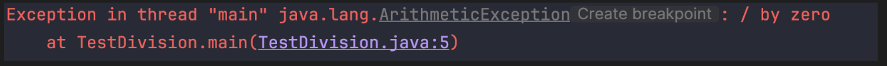

# Taller_Excepciones

## Ejercicio 1

### ¿Qué tipo de excepción se lanza?
Se lanza una excepción de tipo `ArithmeticException`.

### ¿Qué mensaje muestra la consola?

El mensaje indica el tipo de excepción (`ArithmeticException`), el mensaje asociado, y además la clase, método y línea donde se genera la excepción.
